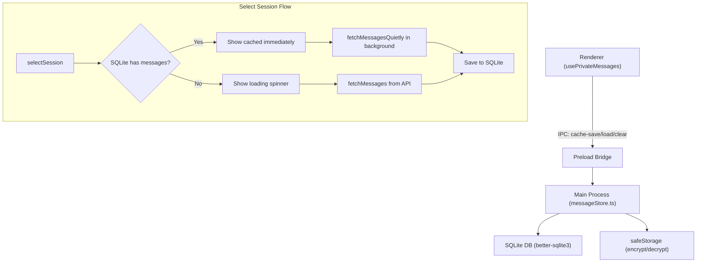

# Persistent Message Storage with SQLite + Encryption

## Architecture



SQLite is the **single source of truth** -- the in-memory `messagesCacheRef` and `emojiCacheRef` are removed entirely. Every session switch loads from SQLite (~3-7ms, imperceptible), and every fetch saves back to SQLite.

## Storage Design

- **Database file**: `messages.db` in `app.getPath('userData')`
- **Encryption**: Each message JSON is encrypted as a BLOB via `safeStorage.encryptString()`. Index columns (account_mid, talker_id, session_type, msg_key, timestamp) remain unencrypted for querying.

**Schema:**

```sql
CREATE TABLE IF NOT EXISTS messages (
  account_mid INTEGER NOT NULL,
  talker_id INTEGER NOT NULL,
  session_type INTEGER NOT NULL,
  msg_key TEXT NOT NULL,
  msg_seqno INTEGER NOT NULL,
  timestamp INTEGER NOT NULL,
  encrypted_data BLOB NOT NULL,
  PRIMARY KEY (account_mid, msg_key)
);
CREATE INDEX IF NOT EXISTS idx_session
  ON messages(account_mid, talker_id, session_type, timestamp);
```

## Files to Change

### 1. New file: `src/api/messageStore.ts`

The core SQLite wrapper. Handles:

- Database initialization (`app.getPath('userData')/messages.db`)
- `saveMessages(accountMid, talkerId, sessionType, messages[])` -- encrypts each message via `safeStorage.encryptString(JSON.stringify(msg))`, uses `INSERT OR REPLACE` for upsert
- `loadMessages(accountMid, talkerId, sessionType)` -- queries by session, decrypts each row, returns `BilibiliMessage[]` sorted by timestamp
- `clearAccountMessages(accountMid)` -- deletes all messages for an account
- `clearAllMessages()` -- wipes the table
- Registers IPC handlers for the above operations

### 2. `package.json` -- add better-sqlite3

```
pnpm add better-sqlite3
pnpm add -D @types/better-sqlite3
```

### 3. `vite.main.config.ts` -- externalize native module

Add `better-sqlite3` to `rollupOptions.external`:

```typescript
external: ['bufferutil', 'utf-8-validate', 'better-sqlite3'],
```

### 4. `forge.config.ts` -- handle native module in asar

Add `asarUnpack` so better-sqlite3's native .node files are extracted from the asar:

```typescript
packagerConfig: {
  asar: true,
  asarUnpack: ['**/node_modules/better-sqlite3/**'],
  // ...
}
```

### 5. `src/lib/ipc.ts` -- add IPC channels + types

Add four new channels to `IpcChannel`:

- `BILIBILI_CACHE_SAVE_MESSAGES`
- `BILIBILI_CACHE_LOAD_MESSAGES`
- `BILIBILI_CACHE_CLEAR_ACCOUNT`
- `BILIBILI_CACHE_CLEAR_ALL`

Add corresponding entries to `IpcInvokeContract` with param/result types.

### 6. `src/types/electron.d.ts` -- extend ElectronAPI

Add to `bilibili` section:

- `cacheSaveMessages(params)` -- save messages for a session
- `cacheLoadMessages(params)` -- load messages for a session
- `cacheClearAccount(params)` -- clear cache for an account
- `cacheClearAll()` -- clear all cached messages

### 7. `src/preload.ts` -- expose new IPC methods

Add the four new methods to `contextBridge.exposeInMainWorld` under `bilibili`.

### 8. `src/main.ts` -- register message store handlers

Import and call `registerMessageStoreHandlers()` from the new `messageStore.ts`, alongside the existing `registerBilibiliIpcHandlers()`.

### 9. `src/hooks/usePrivateMessages.ts` -- replace in-memory cache with SQLite

**Remove** `messagesCacheRef` and `emojiCacheRef` entirely. SQLite becomes the single source of truth.

**selectSession**: Load from SQLite via `cacheLoadMessages()`. If found, show immediately (no loading spinner) + `fetchMessagesQuietly()` in background. If not found, show loading spinner + `fetchMessages()` from API.

**fetchMessages / fetchMessagesQuietly**: After fetching from API, save the resulting messages array to SQLite via `cacheSaveMessages()` (fire-and-forget, don't block UI).

**On logout**: Call `cacheClearAccount()` to wipe that account's persistent cache.

**On account removal**: Call `cacheClearAccount()` for the removed account.

**On account switch**: Do NOT clear SQLite -- just load the new account's cached data. Remove the old `messagesCacheRef.current.clear()` calls for account switch.

**Remove** the `useEffect` that synced messages to `messagesCacheRef` (lines 164-171). The SQLite save after fetch replaces this.

## Cache Lifecycle

- **Select session (any time)**: SQLite load (~3-7ms) -> show instantly if found -> background API refresh -> save to SQLite
- **Logout**: Clear SQLite for that account
- **Account removal**: Clear SQLite for that account
- **Account switch**: Load new account's data from SQLite (no clearing needed)
